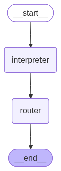

# Example Chatbot CLI with LangGraph using the MVC Pattern

A demonstration of chatbots that cope with mistakes, deal with naturally random human chat interactions like answering not the direct question and correcting previous inforamtion. All while being long-running reliablly, pausable & resumable as well as being focused on its objective of information gathering.

